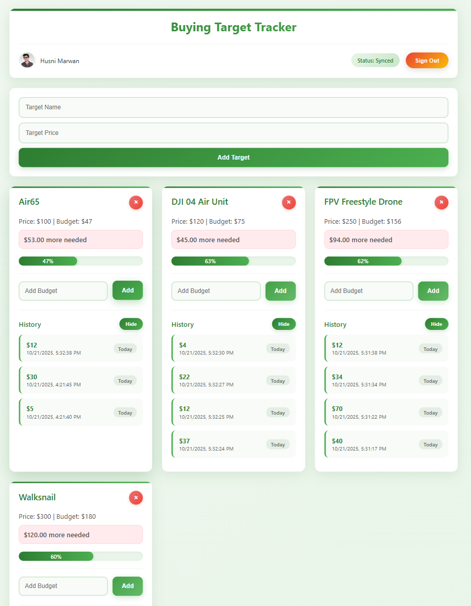

# Buying Target Tracker

A modern React application to help you track your buying targets and savings progress. Set financial goals, add budget amounts, and visualize your progress toward purchasing the items you want.

## Features

- **Create buying targets**: Add items with target prices
- **Track budget progress**: Add budget amounts to work toward your goals
- **Visual progress tracking**: Progress bars showing how close you are to your target
- **Budget history**: Keep track of when and how much you've added to each target
- **Data persistence**: All data is saved using IndexedDB and persists between sessions
- **Modern UI**: Clean, responsive design with smooth interactions
- **Target prioritization**: Newly added targets and recently updated targets appear at the top
- **Recent activity first**: Budget history shows most recent additions first
- **Easy removal**: Delete targets with confirmation

## Screenshots



*Note: Add screenshots to the `./screenshots/` directory and update the image path above.*

## How It Works

- Add a new buying target with a name and target price
- Add budget amounts to track your progress
- See how much more you need to reach each target
- Visual progress bars show your advancement
- History logs keep track of your budget additions
- Data persists in your browser even after closing the tab

## Getting Started

### Prerequisites

- Node.js (version 14 or higher)
- npm or yarn package manager

### Installation

1. Clone or download the repository
2. Navigate to the project directory
3. Install dependencies:

```bash
npm install
```

### Running the Application

To start the development server:

```bash
npm run dev
```

The application will be available at `http://localhost:5173` (or another port if 5173 is in use).

### Building for Production

To create a production build:

```bash
npm run build
```

The built files will be in the `dist` folder.

## Shortcuts

- **Add Target**: Fill in the target name and price, then click "Add Target"
- **Add Budget**: Enter an amount in the budget field and click "Add"
- **Delete Target**: Click the "×" button in the top-right corner of a target
- **View Progress**: Progress bars and percentage values show your progress toward each target

## Technology Stack

- **Frontend**: React 18
- **Styling**: CSS with modern flexbox and grid layouts
- **Database**: IndexedDB via the idb library for browser-based persistence
- **Build Tool**: Vite
- **Package Manager**: npm

## Project Structure

```
buying-target/
├── public/
│   └── vite.svg
├── src/
│   ├── assets/
│   │   └── react.svg
│   ├── utils/
│   │   └── db.js          # IndexedDB database utilities
│   ├── App.jsx            # Main application component
│   ├── App.css            # Application styles
│   ├── main.jsx           # React entry point
│   └── index.css          # Global styles
├── index.html
├── package.json
├── vite.config.js
└── README.md
```

## Future Enhancements

- User authentication with Google SSO
- Cloud synchronization across devices
- Export data functionality
- Budget forecasting and planning tools

## Contributing

Contributions are welcome! Feel free to submit a pull request or open an issue to discuss changes or improvements.

## License

This project is open source and available under the [MIT License](LICENSE).